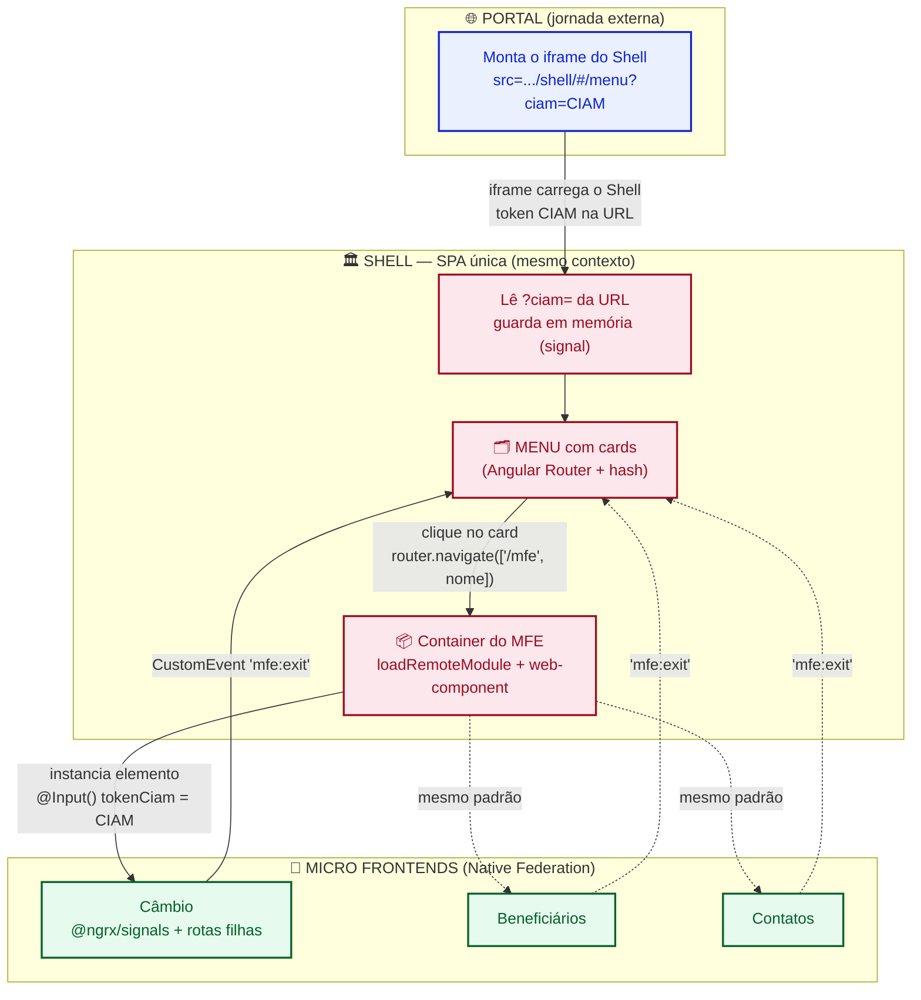
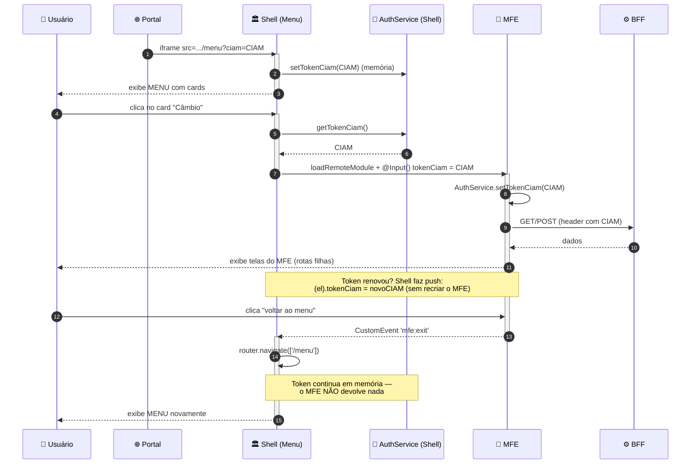

<div align="center">

<h1>🏛️ Guia de Arquitetura — Portal → Shell → MFEs</h1>

<p><strong>Norte inicial para a squad de Portal, Shell (Menu) e Micro Frontends</strong></p>

<p>


</p>

</div>

---

> [!NOTE]
> Este documento é um **guia de referência inicial**, não uma especificação fechada. Os padrões aqui foram **validados contra uma implementação real em produção** (outro produto, outra squad) que já roda Angular 21 + Native Federation com o mesmo modelo de Shell + MFEs via web-component. Onde houver uma escolha que depende do **contrato do BFF de vocês**, o ponto está marcado com o selo <kbd>🟡 DECISÃO DA SQUAD</kbd> — esses pontos vocês definem, o guia não supõe.

---

## 📑 Sumário

1. [Visão geral da arquitetura](#1--visão-geral-da-arquitetura)
2. [A URL: Portal entregando o token ao Shell](#2--a-url-portal-entregando-o-token-ao-shell)
3. [Carregando o MFE no Shell e repassando o token](#3--carregando-o-mfe-no-shell-e-repassando-o-token)
4. [Configuração dos arquivos principais](#4--configuração-dos-arquivos-principais)
5. [Comunicação Shell ↔ MFE (entrar e voltar ao menu)](#5--comunicação-shell--mfe-entrar-e-voltar-ao-menu)
6. [Sessão do token: onde guardar sem `sessionStorage`](#6--sessão-do-token-onde-guardar-sem-sessionstorage)
7. [Estado com NgRx: Signals, Store ou ComponentStore?](#7--estado-com-ngrx-signals-store-ou-componentstore)
8. [Roteamento: Angular Router vs service de rotas](#8--roteamento-angular-router-vs-service-de-rotas)
9. [`shared` / `singleton`: o alinhamento obrigatório](#9--shared--singleton-o-alinhamento-obrigatório)
10. [Diagramas do fluxo Portal → Shell → MFEs](#10--diagramas-do-fluxo-portal--shell--mfes)
11. [Checklist de início de projeto](#11--checklist-de-início-de-projeto)

---

## 1. 🗺️ Visão geral da arquitetura

O fluxo de ponta a ponta tem **três jornadas** encadeadas:

| Camada | Papel | Como é carregada |
|:--|:--|:--|
| **Portal** | Jornada externa que hospeda o Shell e é dona do token do cliente (**CIAM**). | Aplicação própria |
| **Shell (Menu)** | SPA única com uma tela de **cards**. Cada card abre um MFE. Dono do token e da navegação de alto nível. | Dentro de um `<iframe>` no Portal |
| **MFEs** | Cada micro frontend é uma jornada (Câmbio, Beneficiários, etc.) com até ~3 telas, podendo expandir. | Via **Native Federation**, no **mesmo contexto JS** do Shell (web-component) |

> [!IMPORTANT]
> **A premissa central que sustenta todo o resto:** existe **apenas um** `iframe`, na borda **Portal → Shell**. Os MFEs **não** são iframes aninhados — eles são **web-components carregados no mesmo contexto do Shell** via `loadRemoteModule`. É isso que torna o token simples de gerenciar e a comunicação Shell↔MFE idiomática. Se algum dia os MFEs virarem iframes, **toda** a estratégia de token e comunicação deste guia muda.

<div align="center">

```
┌──────────────────────────────────────────────────────────┐
│  PORTAL  (jornada externa)                               │
│   monta o <iframe src=".../shell/#/menu?ciam=<CIAM>">    │
│  ┌────────────────────────────────────────────────────┐  │
│  │  SHELL  (SPA Angular — mesmo contexto)             │  │
│  │   • lê o CIAM da URL e guarda em memória           │  │
│  │   • Tela de MENU com cards                         │  │
│  │   ┌──────────────────────────────────────────┐     │  │
│  │   │  MFE (web-component via Native Federation)│     │  │
│  │   │   recebe CIAM por @Input()                │     │  │
│  │   │   dispara CustomEvent 'mfe:exit' p/ voltar│     │  │
│  │   └──────────────────────────────────────────┘     │  │
│  └────────────────────────────────────────────────────┘  │
└──────────────────────────────────────────────────────────┘
```

</div>

---

## 2. 🔗 A URL: Portal entregando o token ao Shell

O Portal monta o `src` do `iframe` **já com o token CIAM** na URL, exatamente como plataformas hospedeiras costumam fazer. Como o **CIAM é criptografado**, trafegá-lo na URL é aceitável.

**Formato da URL que o Shell espera receber:**

```
https://<HOST_INTERNO>/<caminho>/shell/#/menu?ciam=<CIAM_CRIPTOGRAFADO>
```

Repare em dois detalhes que **não** são acidentais:

- **`#/menu`** → o Shell usa **hash routing** (`withHashLocation()`). Isso evita reescrita de rota no servidor e combina com o embedding em iframe. Ver [seção 8](#8--roteamento-angular-router-vs-service-de-rotas).
- **`?ciam=...`** → o token entra como **query param**. O Shell lê no boot, guarda em memória e — ponto crítico — **NÃO apaga da URL**.

> [!TIP]
> **Por que manter o token na URL resolve o F5 de graça:** o `iframe` é uma SPA que vive em memória. Num **refresh (F5)**, a memória zera. Se o token continuar no `src` do iframe, o Shell simplesmente **lê de novo** e se re-hidrata sozinho — **sem `sessionStorage`, sem `localStorage`, sem `postMessage`**. Se você apagar o token da URL após ler, perde essa rede de segurança e um F5 derruba a sessão.

**Leitura do token no boot do Shell (padrão validado — entrada por query param):**

```typescript
// shell/src/app/core/auth/ciam-token.resolver.ts  (ou no APP_INITIALIZER)
const params = new URLSearchParams(window.location.hash.split('?')[1] ?? '');
const ciam = params.get('ciam');
if (ciam) {
  this.authService.setTokenCiam(ciam); // guarda em memória (signal)
}
// NÃO faça history.replaceState para remover o ciam — mantê-lo re-hidrata no F5.
```

> [!NOTE]
> **Alternativa opcional (`postMessage`):** se a squad quiser o token **fora** da URL, o Portal pode entregá-lo por mensagem, com handshake (`SHELL_READY` → `CIAM_TOKEN`), sempre validando `event.origin`. É mais seguro em teoria, mas **só vale a pena se o Portal conseguir rodar um listener/sender** e se a política pedir. Com o CIAM já criptografado, **o padrão recomendado é o token na URL** pela simplicidade e pelo F5 gratuito.

---

## 3. 📦 Carregando o MFE no Shell e repassando o token

Como o MFE roda **no mesmo contexto** (Native Federation, não iframe), **não existe "URL de navegação" para o MFE nem token em query string entre Shell e MFE**. O Shell:

1. Carrega o *remote* via `loadRemoteModule` (baseado no `remoteEntry.json` do MFE);
2. Instancia o **custom element** (web-component) do MFE;
3. Passa o CIAM (e ids, se houver) como **propriedade / `@Input()`** do elemento.

```typescript
// shell/src/app/mfe/mfe-container.component.ts
import { loadRemoteModule } from '@angular-architects/native-federation';

async carregarMfe(remoteName: string, elementName: string): Promise<void> {
  // 1. carrega o bundle remoto (registra o custom element)
  await loadRemoteModule({
    remoteName,                       // ex.: 'cambio'
    exposedModule: './web-component', // exposto no federation.config.js do MFE
  });

  // 2. cria o elemento no container do Shell
  const el = document.createElement(elementName); // ex.: 'cambio-mfe-root'

  // 3. repassa o token (e ids) como PROPRIEDADE do elemento
  (el as any).tokenCiam = this.authService.getTokenCiam();
  // (el as any).idCliente = this.authService.getIdCliente(); // se aplicável

  // 4. escuta o evento de saída ANTES de anexar (ver seção 5)
  el.addEventListener('mfe:exit', () => this.voltarAoMenu());

  this.containerRef.nativeElement.appendChild(el);
  this.elAtual = el;
}
```

> [!TIP]
> **Atualização de token em runtime sem recriar o MFE:** quando o CIAM renova durante a sessão, **não** destrua e recrie o MFE. Basta empurrar o novo valor na propriedade do elemento já vivo:
> ```typescript
> (this.elAtual as any).tokenCiam = novoCiam;
> ```
> Esse é o padrão de "push de token" — o Shell é a fonte da verdade e o MFE reage à mudança da property. Vale ter um `TokenUpdateService` no Shell que emite o token novo, e o container reage a ele.

O que vira "configuração de URL" aqui **não** é rota com token — é o **manifest de federação** apontando para o `remoteEntry.json` de cada MFE. Ver seção 4.

---

## 4. ⚙️ Configuração dos arquivos principais

### 4.1 Shell (host)

**`shell/src/assets/federation.manifest.json`** — mapa dos remotes **por ambiente**. Liste **todos** os MFEs aqui (evita a fragilidade de resolver remotes só via config injetado em runtime):

```json
{
  "cambio": "https://<HOST_INTERNO>/cambio/remoteEntry.json",
  "beneficiarios": "https://<HOST_INTERNO>/beneficiarios/remoteEntry.json",
  "contatos": "https://<HOST_INTERNO>/contatos/remoteEntry.json"
}
```

**`shell/src/main.ts`** — inicializa a federação **antes** de subir o Angular:

```typescript
import { initFederation } from '@angular-architects/native-federation';

initFederation('/assets/federation.manifest.json')
  .catch(err => console.error('[Shell] Falha ao iniciar federação', err))
  .then(() => import('./bootstrap'))
  .catch(err => console.error(err));
```

**`shell/src/bootstrap.ts`**:

```typescript
import { bootstrapApplication } from '@angular/platform-browser';
import { appConfig } from './app/app.config';
import { AppComponent } from './app/app.component';

bootstrapApplication(AppComponent, appConfig);
```

**`shell/src/app/app.config.ts`** — Router com **hash location**:

```typescript
import { ApplicationConfig } from '@angular/core';
import { provideRouter, withHashLocation } from '@angular/router';
import { routes } from './app.routes';

export const appConfig: ApplicationConfig = {
  providers: [
    provideRouter(routes, withHashLocation()),
  ],
};
```

### 4.2 MFE (remote)

**`mfe/federation.config.js`** — expõe o web-component e declara `shared` (ver [seção 9](#9--shared--singleton-o-alinhamento-obrigatório)):

```javascript
const { withNativeFederation, shareAll } = require('@angular-architects/native-federation/config');

module.exports = withNativeFederation({
  name: 'cambio',
  exposes: {
    './web-component': './src/bootstrap-webcomponent.ts',
  },
  shared: {
    ...shareAll({ singleton: true, strictVersion: true, requiredVersion: 'auto' }),
  },
});
```

**`mfe/src/bootstrap-webcomponent.ts`** — registra o custom element via `@angular/elements`:

```typescript
import { createApplication } from '@angular/platform-browser';
import { createCustomElement } from '@angular/elements';
import { appConfig } from './app/app.config';
import { AppComponent } from './app/app.component';

(async () => {
  const app = await createApplication(appConfig);
  const el = createCustomElement(AppComponent, { injector: app.injector });
  customElements.define('cambio-mfe-root', el);
})();
```

**`mfe/src/app/app.component.ts`** — recebe o token por `@Input()`:

```typescript
@Component({ /* ... */ })
export class AppComponent implements OnInit {
  @Input() tokenCiam = '';
  // @Input() idCliente = '';  // 🟡 DECISÃO DA SQUAD (ver seção 6)

  private auth = inject(AuthService);

  ngOnInit(): void {
    this.auth.setTokenCiam(this.tokenCiam); // guarda no singleton em memória
  }
}
```

**`mfe/src/app/core/http.service.ts`** — injeta o token no header a cada chamada ao BFF:

> [!WARNING]
> 🟡 **DECISÃO DA SQUAD** — o **nome do header** e **quantos tokens** existem dependem do BFF de vocês. O padrão abaixo é uma **base**: ajustem conforme o contrato real.

```typescript
getHeaders(): HttpHeaders {
  return new HttpHeaders({
    // Opção A: CIAM no Authorization
    'Authorization': `Bearer ${this.auth.getTokenCiam()}`,

    // Opção B: CIAM em header próprio (caso exista também um token de usuário)
    // 'Authorization': `Bearer ${this.auth.getTokenUsuario()}`,
    // 'x-brad-access-token-cliente': this.auth.getTokenCiam(),
  });
}
```

O ideal é fazer isso num **`HttpInterceptor`** global, para não repetir header em cada serviço.

---

## 5. 🔄 Comunicação Shell ↔ MFE (entrar e voltar ao menu)

Este é o comportamento que o projeto novo **precisa ter** e que implementações antigas de MFE muitas vezes **não têm**: o usuário entra num MFE e depois **volta ao menu** para abrir outro.

**Regra de ouro — quem manda em quê:**

- O **Shell** é dono da navegação de **alto nível**: menu ↔ container do MFE.
- Cada **MFE** é dono da navegação **interna** das suas telas.
- **Um não conhece as rotas do outro.**

### Ida (card → MFE)

```typescript
// Shell — ao clicar no card
this.router.navigate(['/mfe', 'cambio']);
// a rota container instancia o web-component e passa o tokenCiam (seção 3)
```

### Volta (MFE → menu)

O MFE **não** navega sozinho para o menu — ele **não sabe** a rota do Shell. Ele apenas **avisa** que quer sair, disparando um `CustomEvent`:

```typescript
// MFE — botão "voltar ao menu"
voltarAoMenu(): void {
  this.elementRef.nativeElement.dispatchEvent(
    new CustomEvent('mfe:exit', { bubbles: true, composed: true })
  );
}
```

E o Shell, que **hospeda** o elemento, escuta e decide o que fazer:

```typescript
// Shell — no container do MFE
el.addEventListener('mfe:exit', () => {
  this.router.navigate(['/menu']);
});
```

> [!TIP]
> Esse mesmo canal de `CustomEvent` serve para **qualquer** sinal futuro do MFE para o Shell. Vale definir um **contrato de eventos** pequeno e versionado, por exemplo:
>
> | Evento | Direção | Significado |
> |:--|:--|:--|
> | `mfe:exit` | MFE → Shell | "Terminei, volte ao menu" |
> | `mfe:navigate` | MFE → Shell | "Abra este outro MFE" (payload com o nome) |
> | `mfe:session-expired` | MFE → Shell | "Token inválido, trate a sessão" |
>
> Do Shell para o MFE, a comunicação é por **propriedade** (ex.: atualizar `tokenCiam`), como na seção 3.

---

## 6. 🔐 Sessão do token: onde guardar sem `sessionStorage`

> [!IMPORTANT]
> Como o MFE roda **no mesmo contexto** do Shell, o Shell é uma SPA que **nunca descarrega** ao navegar menu ↔ MFE ↔ menu. Portanto:
> **um serviço singleton em memória (`providedIn: 'root'`, com `signal`) é suficiente.** O Shell **nunca perde** o token ao trocar de MFE.

```typescript
// shell/src/app/core/auth/auth.service.ts
@Injectable({ providedIn: 'root' })
export class AuthService {
  private readonly _tokenCiam = signal<string>('');

  setTokenCiam(token: string): void { this._tokenCiam.set(token); }
  getTokenCiam(): string { return this._tokenCiam(); }

  readonly tokenCiam = this._tokenCiam.asReadonly();
}
```

**Decisões importantes que caem por terra (e por quê):**

- ❌ **"O MFE precisa devolver o token no retorno ao Shell."** — **Não precisa.** Isso só faria sentido se fossem contextos separados (iframes). Aqui o Shell é a **fonte da verdade**: ele guarda, ele repassa uma cópia read-only ao MFE, e no retorno **ele já tem o token**. Devolver adicionaria risco sem benefício.
- ❌ **`sessionStorage` / `localStorage`.** — Proibido e desnecessário. O token vive em memória; o **F5** é coberto por manter o CIAM na URL do iframe (seção 2).

**Resumo do ciclo de vida do token:**

| Momento | O que acontece |
|:--|:--|
| Boot do Shell | Lê `?ciam=` da URL → `AuthService.setTokenCiam()` (memória) |
| Abrir um MFE | Shell passa cópia read-only via `@Input() tokenCiam` |
| Navegar entre MFEs | Shell **mantém** o token; nada se perde |
| Renovação do token | Shell atualiza a property do elemento vivo (push) |
| **F5 / refresh** | URL ainda tem `?ciam=` → Shell re-hidrata sozinho |

> [!NOTE]
> 🟡 **DECISÃO DA SQUAD** — se o BFF exigir `idCliente`/`idConta` na URL das chamadas (ex.: `clientes/{idCliente}/contas/{idConta}/...`), o Shell deve repassar esses ids **junto** com o token (mais um `@Input()`). Se o CIAM já carrega tudo que o BFF precisa, basta o token. Isso depende do contrato do BFF de vocês.

---

## 7. 🧩 Estado com NgRx: Signals, Store ou ComponentStore?

> [!TIP]
> **Recomendação: `@ngrx/signals` (SignalStore), um por MFE, com escopo de feature.** Padrão validado numa implementação real de MFE do mesmo tipo.

**Por quê:**

- Angular 21 é **signals-first**; o SignalStore é o encaixe natural.
- MFEs de ~3 telas **não** justificam o Store clássico (actions + reducers + effects) — é cerimônia demais.
- **ComponentStore** é para estado efêmero de **um único componente** — pequeno demais para o estado de uma feature/MFE.
- O SignalStore é o meio-termo certo e **escala** se um MFE crescer para muitas telas.

```typescript
// mfe/src/app/state/cambio.store.ts
import { signalStore, withState, withMethods, patchState } from '@ngrx/signals';
import { rxMethod } from '@ngrx/signals/rxjs-interop';

export const CambioStore = signalStore(
  { providedIn: 'root' },
  withState({ operacoes: [], carregando: false, erro: null as string | null }),
  withMethods((store, service = inject(CambioService)) => ({
    carregarOperacoes: rxMethod<void>(/* ... pipe com tap/switchMap ... */),
    limpar: () => patchState(store, { operacoes: [], erro: null }),
  })),
);
```

**E o Shell?** O Shell é basicamente **menu + token** — **não precisa de NgRx**. Um serviço com `signal` (como o `AuthService` da seção 6) resolve. Reserve um store global só se, no futuro, surgir estado **compartilhado entre MFEs**.

| Opção | Quando usar | Aqui? |
|:--|:--|:--|
| **SignalStore** (`@ngrx/signals`) | Estado de feature, signals-first | ✅ **nos MFEs** |
| Store clássico | Estado global complexo, muitos effects | ❌ overhead |
| ComponentStore | Estado de um componente isolado | ❌ pequeno demais |
| Serviço com `signal` | Estado simples (token, menu) | ✅ **no Shell** |

---

## 8. 🧭 Roteamento: Angular Router vs service de rotas

> [!TIP]
> **Recomendação: Angular Router nos dois lados.** No Shell, para menu ↔ container do MFE. Em cada MFE, rotas **filhas** para as telas internas.

**Por que não um "service de rotas" caseiro** (do tipo `RouterService` com `BehaviorSubject`): você joga fora **lazy loading, guards, deep-link, histórico e `runGuardsAndResolvers`** — e reimplementa mal o que o framework já faz bem. Um service de rotas é dívida técnica desde o dia 1.

**Shell:**

```typescript
// shell/src/app/app.routes.ts
export const routes: Routes = [
  { path: 'menu', component: MenuComponent },
  { path: 'mfe/:remote', component: MfeContainerComponent },
  { path: '', redirectTo: 'menu', pathMatch: 'full' },
];
// app.config.ts → provideRouter(routes, withHashLocation())
```

**MFE (rotas internas):**

```typescript
// mfe/src/app/app.routes.ts
export const routes: Routes = [
  { path: '', redirectTo: 'dashboard', pathMatch: 'full' },
  { path: 'dashboard', component: DashboardComponent },
  { path: 'detalhe', component: DetalheComponent },
  { path: 'confirmacao', component: ConfirmacaoComponent },
  // lazy quando crescer:
  // { path: 'x', loadComponent: () => import('./x/x.component').then(m => m.XComponent) },
];
```

> [!NOTE]
> **Hash location** (`withHashLocation()`) é recomendado por causa do embedding em iframe: evita reescrita de rota no servidor e combina com o `#/menu` da URL (seção 2).

---

## 9. 🔧 `shared` / `singleton`: o alinhamento obrigatório

> [!WARNING]
> Este é um **risco real** de projetos com Native Federation e a principal fonte de bugs difíceis: se Shell e MFE carregarem **duas cópias** do Angular, a aplicação quebra em runtime de formas confusas. **Os dois lados precisam declarar `shared` de forma consistente.**

**Regras para a squad seguir desde o início:**

1. **Declarar `shared` nos dois lados** (host e todos os remotes) — não deixe o Shell sem config de `shared`.
2. **`singleton: true`** para o core do framework: `@angular/core`, `@angular/common`, `@angular/router`, `@angular/platform-browser`, e o `@ngrx/signals`.
3. **Fixar a MESMA versão** de Angular e de `@angular-architects/native-federation` em **todos** os repositórios (host + remotes). Divergências de patch já bastam para dar dor de cabeça.
4. Preferir **`strictVersion: true`** para descobrir incompatibilidades **em build**, não em produção.

```javascript
// federation.config.js — mesma base no Shell e em TODOS os MFEs
shared: {
  ...shareAll({ singleton: true, strictVersion: true, requiredVersion: 'auto' }),
},
```

> [!IMPORTANT]
> Combine uma **matriz de versões** compartilhada entre os repositórios (ex.: um arquivo/documento único com as versões "abençoadas" de Angular, native-federation e NgRx) e faça CI falhar se um repo divergir. É barato agora e caro depois.

---

## 10. 🎨 Diagramas do fluxo Portal → Shell → MFEs

### 10.1 Visão geral (arquitetura + fluxo de ida e volta)



### 10.2 Sequência: entrar num MFE, usar e voltar ao menu



> [!NOTE]
> **Cores dos diagramas** seguem a paleta institucional: **azul CTA** (`#3b69ff`) para o Portal, **vermelho institucional** (`#cc092f` / `#9d0b21`) para o Shell e **verde estendido** (`#09ab47` / `#056129`) para os MFEs.

---

## 11. ✅ Checklist de início de projeto

**Shell**
- [ ] `federation.manifest.json` por ambiente com **todos** os remotes
- [ ] `initFederation()` no `main.ts` antes do bootstrap
- [ ] `provideRouter(routes, withHashLocation())`
- [ ] `AuthService` singleton com `signal` guardando o CIAM
- [ ] Ler `?ciam=` no boot e **não apagar** da URL
- [ ] Container que faz `loadRemoteModule`, passa `tokenCiam` e escuta `mfe:exit`
- [ ] `shared` declarado com `singleton: true`

**MFE**
- [ ] `federation.config.js` com `exposes: { './web-component': ... }`
- [ ] `bootstrap-webcomponent.ts` registrando o custom element
- [ ] `@Input() tokenCiam` no componente raiz → `AuthService` singleton
- [ ] `HttpInterceptor` injetando o token no header 🟡 *(nome do header = decisão da squad)*
- [ ] `@ngrx/signals` (SignalStore) para o estado
- [ ] Angular Router com rotas filhas (nada de `RouterService` caseiro)
- [ ] Botão "voltar" disparando `CustomEvent('mfe:exit')`
- [ ] `shared` **idêntico** ao do Shell (mesmas versões)

**Transversal**
- [ ] Matriz de versões única (Angular + native-federation + NgRx) entre os repos
- [ ] Contrato de eventos Shell↔MFE documentado (`mfe:exit`, etc.)
- [ ] 🟡 Definir com o BFF: um ou dois tokens, nome do header, necessidade de `idCliente`/`idConta`

---

<div align="center">

<sub>Guia de referência inicial • Padrões validados contra implementação real em produção • Angular 21 + Native Federation 21</sub>

</div>